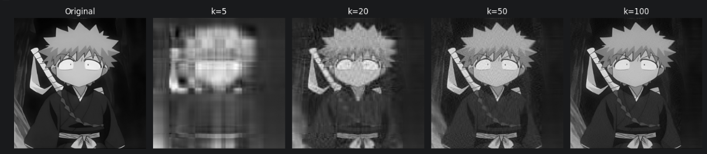
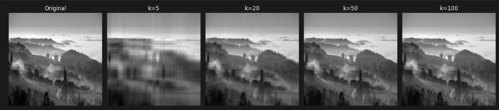
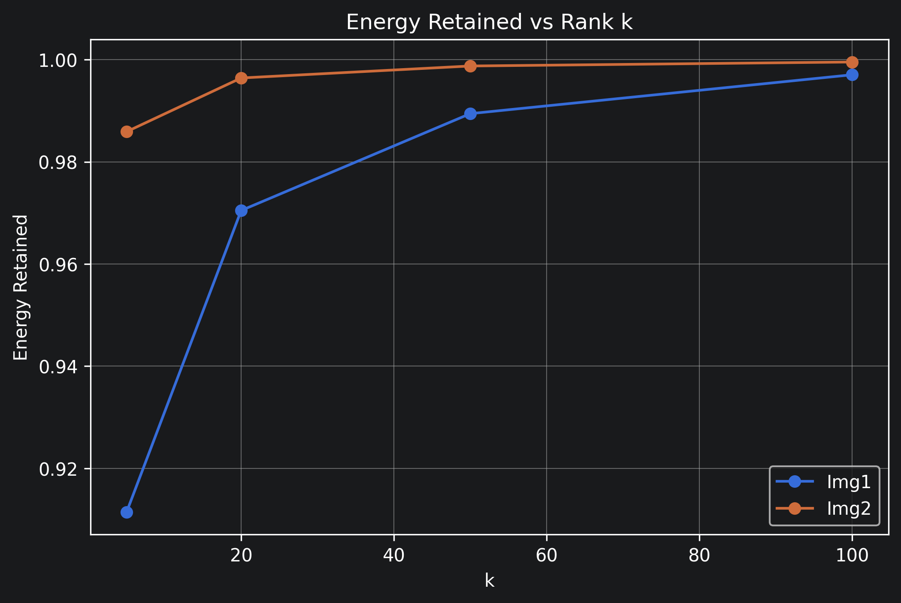
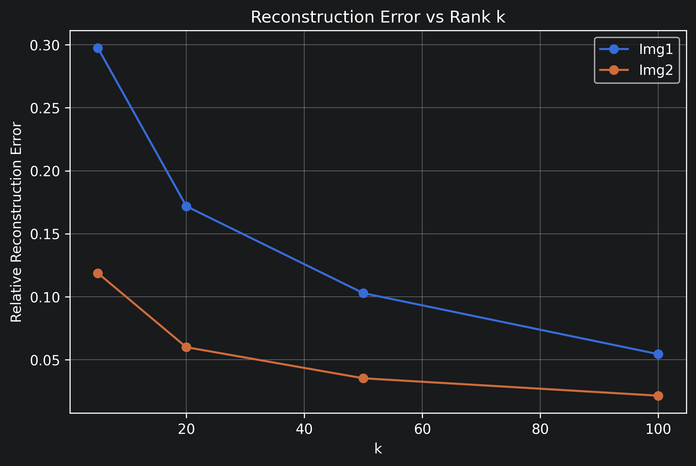
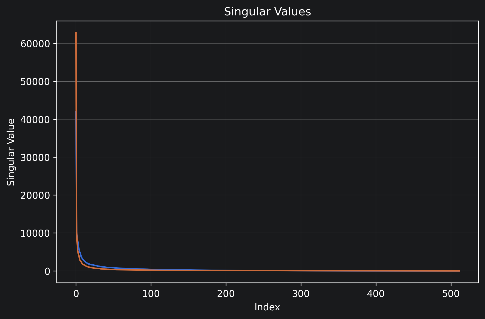
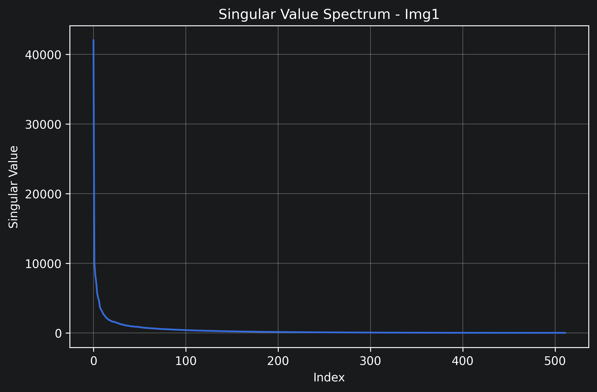
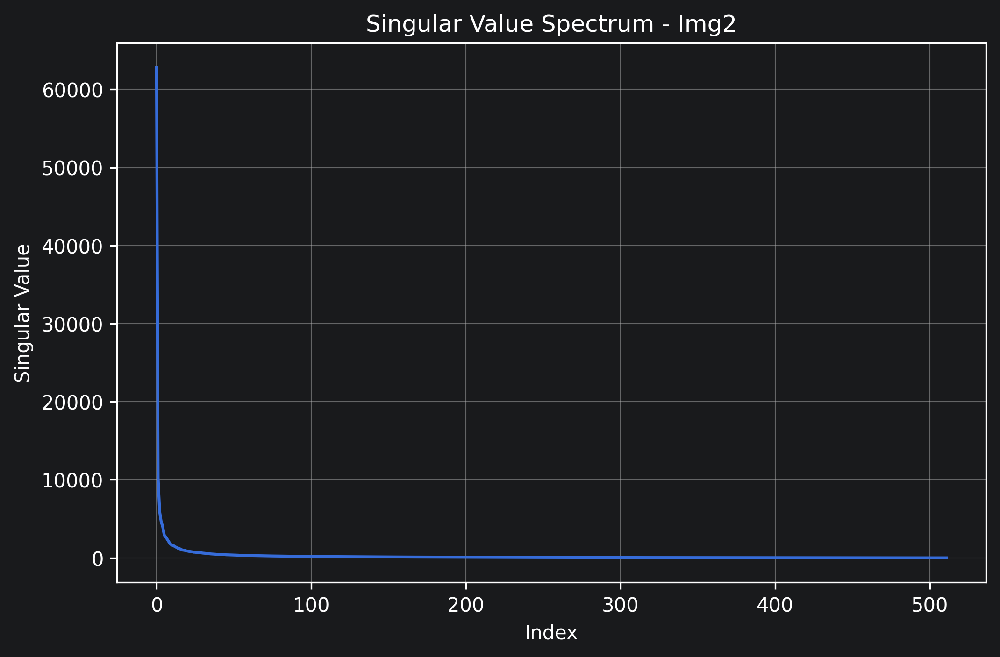
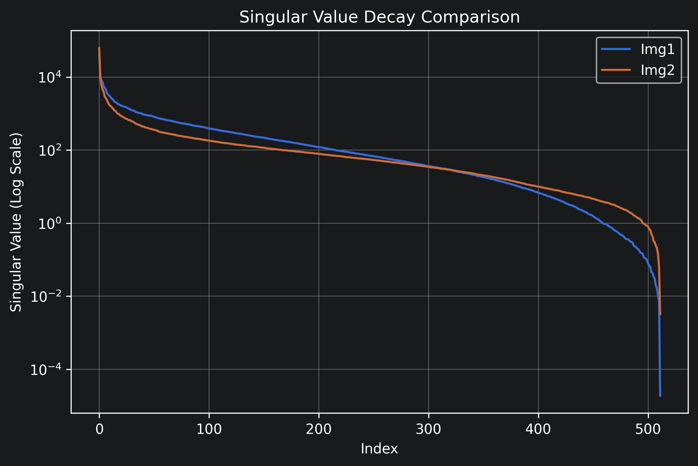

#  Image Compression using Singular Value Decomposition (SVD)

A Python implementation of **image compression using Singular Value Decomposition (SVD)**. This project demonstrates how low-rank matrix approximation can significantly reduce image storage requirements while preserving most of the visual information.

The implementation analyzes the effect of different rank values (**k**) on image quality, energy retention, and reconstruction error, providing both qualitative and quantitative comparisons.

---

##  Features

-  Image compression using Singular Value Decomposition (SVD)
-  Supports grayscale and RGB images (via YUV color space)
-  Energy retention analysis
-  Relative reconstruction error analysis
-  Singular value spectrum visualization
-  Comparison of multiple images
-  Side-by-side image reconstruction for different compression levels

---

##  Tech Stack

| Category | Technologies |
|----------|--------------|
| Language | Python |
| Numerical Computing | NumPy |
| Image Processing | OpenCV |
| Visualization | Matplotlib |
| Notebook | Jupyter Notebook |

---

#  Repository Structure

```
SVD-Image-Compression/
│
├── README.md
├── requirements.txt
├── .gitignore
│
├── notebook/
│   └── svd_image_compression.ipynb
│
├── images/
│   ├── image1.jpg
│   └── image2.jpg
│
├── results/
│   ├── comparison.png
│   ├── Energy_retained.png
│   ├── Reconstruction.png
│   ├── singular_values_comparison.png
│   ├── singular_values_img1.png
│   ├── singular_values_img2.png
│   └── singular_values_log_comparison.png
│
└── docs/
    └── Project_Report.pdf
```

---

#  What is Singular Value Decomposition?

Singular Value Decomposition (SVD) factorizes an image matrix **A** into three matrices:

\[
A = U\Sigma V^T
\]

where

- **U** contains the left singular vectors
- **Σ** contains singular values
- **Vᵀ** contains the right singular vectors

Instead of storing all singular values, only the largest **k** singular values are retained.

The reconstructed image becomes

\[
A_k = U_k \Sigma_k V_k^T
\]

This produces a low-rank approximation that preserves the most important image information while reducing storage.

---

#  Workflow

```
Original Image
       │
       ▼
Convert to YUV Color Space
       │
       ▼
Apply SVD
       │
       ▼
Keep Top-k Singular Values
       │
       ▼
Reconstruct Image
       │
       ▼
Compressed Image
       │
       ▼
Evaluate Quality Metrics
```

---

#  Image Reconstruction at Different Rank Values

Singular Value Decomposition enables image compression by retaining only the **top-k singular values** of the image matrix. Smaller values of **k** provide higher compression but introduce greater information loss, whereas larger values preserve finer image details at the cost of lower compression.

The figures below compare the original images with their reconstructed versions for **k = 5, 20, 50, and 100**, illustrating the trade-off between compression and visual quality.

### Image 1



---

### Image 2


#  Evaluation Metrics

The project evaluates compression quality using:

- Energy Retained
- Relative Reconstruction Error
- Singular Value Spectrum
- Visual Image Comparison

These metrics help determine the optimal value of **k** for balancing image quality and compression.

---

#  Results

## Energy Retained

Higher values indicate that more image information has been preserved.



---

## Reconstruction Error

Lower reconstruction error corresponds to better image quality.



---

## Singular Value Comparison

The rapid decay of singular values explains why only a small number of singular values are sufficient for high-quality image reconstruction.



---

## Singular Value Spectrum (Image 1)



---

## Singular Value Spectrum (Image 2)



---

## Log Scale Comparison

A logarithmic view highlights the decay rate of singular values across both images.



---

#  Installation

Clone the repository

```bash
git clone https://github.com/<your-username>/SVD-Image-Compression.git
```

Navigate to the project folder

```bash
cd SVD-Image-Compression
```

Install dependencies

```bash
pip install -r requirements.txt
```

---

#  Running the Project

Launch the notebook

```bash
jupyter notebook
```

Open

```
notebook/svd_image_compression.ipynb
```

Run all cells sequentially.

---

#  Applications

SVD-based image compression is widely used in

- Image compression
- Computer Vision
- Medical Imaging
- Facial Recognition
- Pattern Recognition
- Recommendation Systems
- Principal Component Analysis (PCA)
- Signal Processing

---

#  Future Improvements

- Interactive Streamlit web application
- Compression ratio calculator
- Support for batch image compression
- Image quality metrics (PSNR & SSIM)
- GPU acceleration
- Comparison with JPEG compression
- Interactive slider for selecting rank **k**

---

#  Authors

**Sohham Choudhary**  
BS Data Science & Artificial Intelligence  
Indian Institute of Management Sambalpur

---

